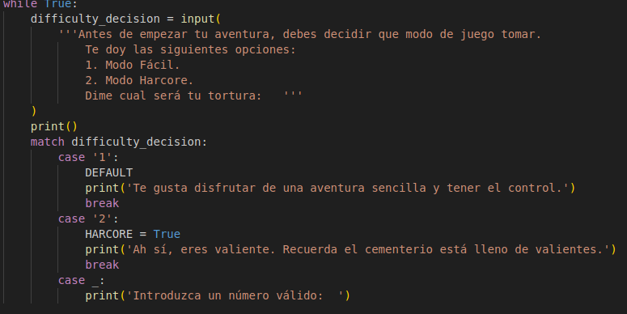
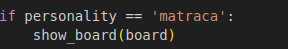
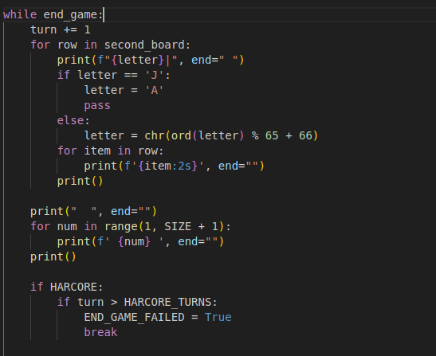
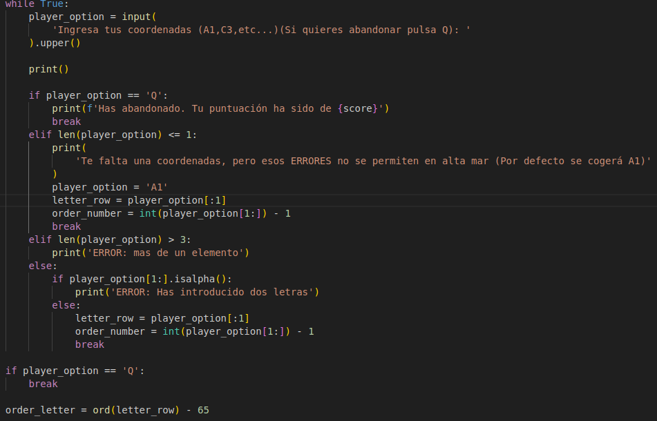
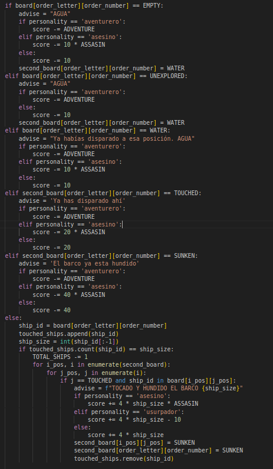
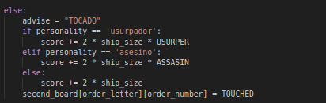
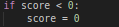

<h1> Hundir la flota. </h1>

<h2>Introducción y normas.</h2>

Hundir la flota (Battleship) es un popular juego de mesa en el que dos jugadores posicionan sus barcos en un tablero de coordenadas y el rival debe adivinar la posicion de los barcos y acabar con ellos. Nuestro objetivo en este proyecto es recrear este juego con Python y hacerlo jugable a traves de la terminal del ordenador, en este caso tu rival es la propia terminal y debes hundir sus barcos.

Para ello hemos aplicado las normas del juego original mas algun añadido que explicaremos mas adelante para hacerlo mas interesante ;) .

Comencemos explicando los distintos tipos de naves que existen:

<h3>Tipos de barcos.</h3>

<ul>
<li>1 portaaviones que ocupa 5 casillas.</li>
<li>1 acorazado que ocupa 4 casillas.</li>
<li>2 submarinos que ocupan 3 casillas.</li>
<li>1 destructor que ocupa 2 casillas.</li>
</ul>
En este caso los barcos serán colocados aleatoriamente en el tablero de nuestro rival.

<h2>Desarrollo del juego</h2>

Antes de comenzar el enfrentamiento debemos preparar unos ajustes para que la batalla se adapte mas a las necesidades de cada jugador.

Primero debemos seleccionar entre dos modos de juego:

<h4><li>Modo Clásico:</li></h4>

<h4><li>Modo Hardcore:</li></h4>

Una vez seleccionado el modo seleccionaremos la personalidad que mas nos defina entre los siguientes personajes. Ten encuenta que cada personaje añade una característica distinta al modo de juego.

<h3>Personajes</h3>
<h4>Usurpador:</h4>

Famoso contrabandista del Pacífico Sur especializado en robos de alta mar. La agilidad y su sangre fría son la clave del éxito en sus trabajos, aunque a veces peca de ser impulsivo.

Este personaje te dará el doble de puntuación al tocar un barco, pero al hundirlo se te restaran 10 puntos.

<h4>Aventurero:</h4>

Joven aventurero que surcó los mares en busca de aventuras y nuevos horizontes. Su inteligencia le ha salvado de todos los contratiempos que el océano le ha puesto delante.

El aventurero corresponde al modo de juego normal

<h4><li>Asesino:</li></h4>

Robot mitad ladron, mitad asesinó a sangre fría, le gusta rebanar cabezas a los que se le cruzan en su camino hacia su botín.

Si hundes un barco o lo tocas, se te recompensará con el doble de puntos correspondientes. Pero si fallas, se te quitará el doble también.

<h2>Explicación del código:</h2>

En este fragmento del codigo es donde esta representada la elección de la dificultad cuando inicias la partida

---

En este fragmento de codigo es donde se consigue crear el menu de eleccion de personalidad donde cada una personalizara la partida de diversas formas

---

En este pequeño fragmento de codigo tenemos un EASTER EGG dedicado a la palabra favorita de nuestro profe Sergio, el cual se introducira en la seleccion de personalidades poniendo 'matraca' se mostrara un tablero con las posiciones de los barcos.

---

En este fragmento de codigo esta representado un añadido a la idea original que sergio nos dio del juego hundir la flota, un modo hardcore el cual seria tener una cantidad limitada de disparos para hundir los barcos, si se acabaran los intentos saltaria la pantalla de derrota

---

En este fragmento de codigo esta representado laforma de pedir las cordenadas que el jugador ponga, tambien hay una forma de salir del juego en caso de que no quisiera continuar, pulsando la Q

---

En estre fragmento de codigo esta representada la forma de validar las posiciones de los colores, sumar o restar los puntos, asi como un aviso por si decides disparar a la misma casilla, se le dara un mensaje al jugador de que esa casilla ya ha sido disparada

---

 
 Por último en este fragmento de codigo se representa la forma de igualar a 0 los puntos si estos baja por debajo de cero

---

Ademas, añadimos imagenes al juego para hacerlo mas colorido, como texto en ascci para que se viera mejor  

